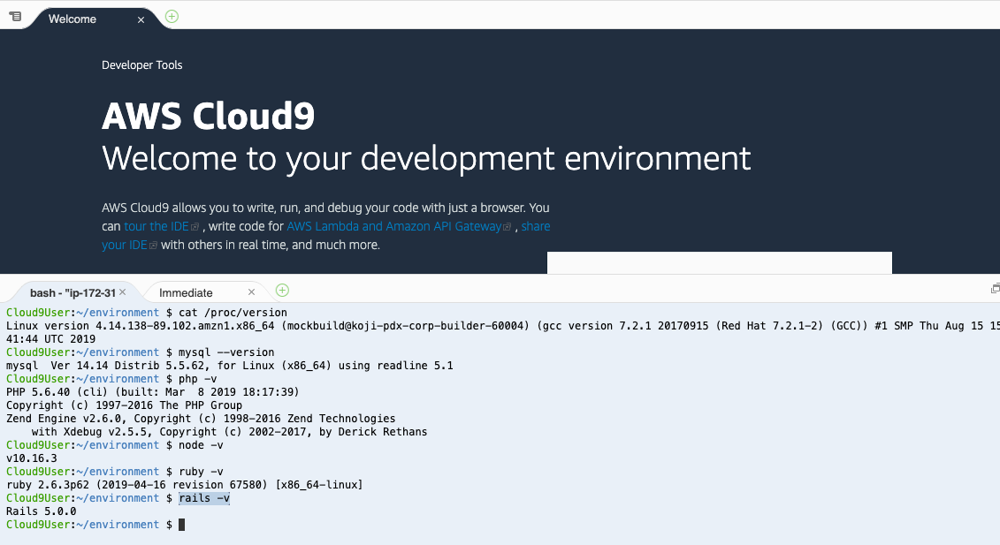
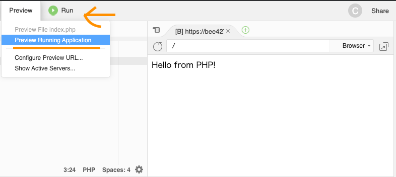
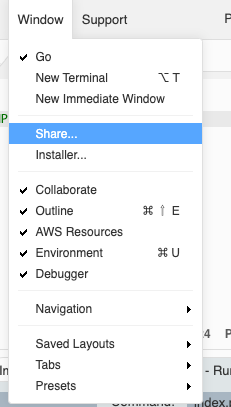
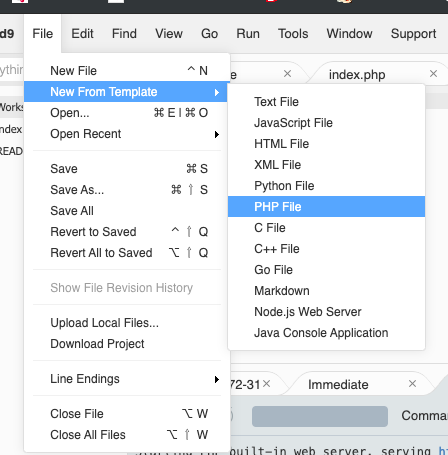
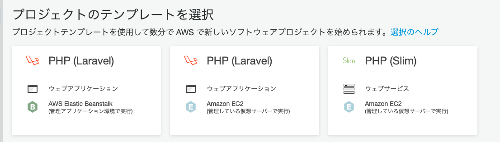

 ### Cloud9を使う

参考：https://dotinstall.com/lessons/basic_c9_v2

###  CloudWatchで請求アラート表示

##### 目的:　AWSはお金がかかるため、請求時にメールを飛ばすようにする

・CloudWatchを選択
・請求を選択 
・アラート表示する金額とアドレスを登録する

###  Cloud9利用ユーザ作成

##### 目的:　AWSはサービスが多様なため、Cloud9だけ利用できるユーザーを追加する

・IAMを選択
・グループを作成。【Cloud9User】と名付ける。
・ポリシーのアタッチで、【AWSCloud9User】を選択
・確認後、OK選択
・IAMを選択
・ユーザを作成。【Cloud9User】と名付ける。
・確認後、OK選択
・以下のように設定　
		・AWSマネージメントコンソールアクセスにチェック。
		・自動生成パスワードにチェック
		・パスワードのリセットにチェック

・グループ選択で上記で作成したグループを選択
・タグは空欄にして、ユーザ作成。表示されるCSVファイルはダウンロードしてとっておく。

###  Cloud9作成

##### 目的:　いよいよCloud9の利用開始する

・Cloud9を選択
・CreateProjectを選択
・Nameに、【MyWorkspase】を入れて、次へ
・使用サーバーをEC2とインスタンスタイプをt2.microとプラットフォームをAmazonLinuxを選択して次へ
・確認問題なければ、OK選択。構築に時間かかる。。。

###  Cloud9の環境を確認する

##### 目的:　Cloud9の設定内容をコマンドで確認すると古いことがわかる

・ターミナルより以下を実行

cat /proc/version OSの確認
mysql --version　MySQLの確認 
php -v　PHPのバージョン確認 
node -v　Nodeの確認 
ruby -v　Rubyのバージョン確認
rails -v　RubyOnRailsのバージョン確認  



###  Cloud9の環境を更新する

##### 目的:　Cloud9の設定が古いため最新化&システム時間を東京にする

・以下ターミナルよりコマンド実行

```shell
sudo yum -y update

date
sudo vi /etc/sysconfig/clock

  ZONE="Asia/Tokyo"
  UTC=true

sudo ln -sf /usr/share/zoneinfo/Asia/Tokyo /etc/localtime
sudo reboot
date
```

###  Cloud9の環境を更新する〜MYSQL

##### 目的:　MySQLの内容を最新化する

・以下ターミナルよりコマンド実行

```shell
mysql --version 
# mysql  Ver 14.14 Distrib 5.5.62, for Linux (x86_64) using readline 5.1 
sudo yum -y remove mysql-config mysql55-server mysql55-libs mysql55
sudo yum -y install mysql57-server mysql57
sudo vi /etc/my.cnf
### here -----
  [mysqld]
  character-set-server=utf8mb4

  [client]
  default-character-set=utf8mb4
### here -----
sudo service mysqld start
sudo mysql_upgrade -u root --force
sudo service mysqld restart
sudo chkconfig mysqld on #自動起動ON
mysql --version
mysql -u root
quit
```

###  Cloud9の環境を更新する〜PHP

##### 目的:　PHPの内容を最新化する

・以下ターミナルよりコマンド実行

```shell
php -v
sudo yum -y install php72 php72-devel php72-mysqlnd php72-gd php72-intl php72-mbstring
sudo update-alternatives --config php
# Enter to keep the current selection[+], or type selection number: 2と入力
php -v
```

###  Cloud9のPHPを作成する

##### 目的:　 Cloud9でPHPファイルを作成

・以下ターミナルよりコマンド実行

```shell
touch index.php
```

・エディタに表示されたファイルを編集する

```php
<?php

echo "Hello from PHP!";
```

・画面右上のRunを実行すると、ビルドサーバーが立ち上がる

・PreviewのPreviewRunningApplicatioを選択するとコードの内容を閲覧することができる



###  Cloud9の便利機能を把握する

##### 目的:　 Cloud9のその他便利機能

#### Git連携

・GithubとCloud9の連携（ターミナル内にGitリポジトリ作ってコミットする）

####  ソースファイルの共有

・Windowー＞Shareから表示されるURLをコピーして共有する。

※　相手も、AWSアカウント必要



#### テンプレート作成

・Fileー＞NewFromTemplateから対象のファイルを選択する



#### 上記よりもっとカンタンにCloud9でアプリケーションを構築する

### 目的:テンプレートを入力するだけで、Git管理からテンプレート作成、環境構築まで行える

サーバーレスアプリケーションを構築する（AWS CodeStar と AWS Cloud9）

参考：https://aws.amazon.com/jp/getting-started/tutorials/build-serverless-app-codestar-cloud9/?useful=yes

・AWS CodeStarを選択

・該当のプロジェクトを選択

