### CodeStarを使う 〜laravel〜

CodeStarを選択して新規プロジェクトの作成選択
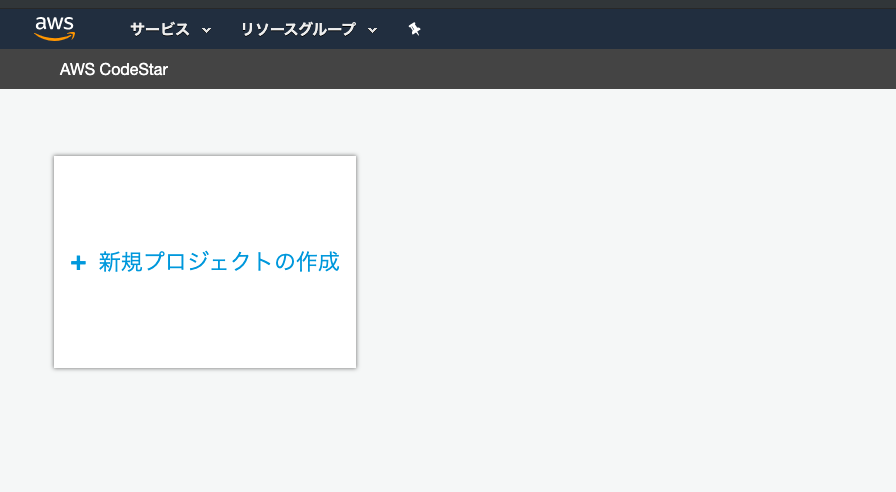

プロジェクトのテンプレートでPHP(Laravel)を選択

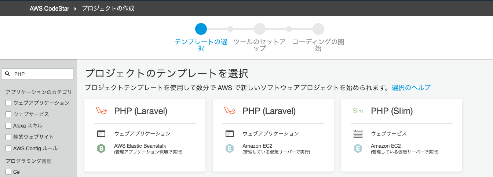

プロジェクト名を入力。Githubに接続で、自身のGithubアカウントにログイン。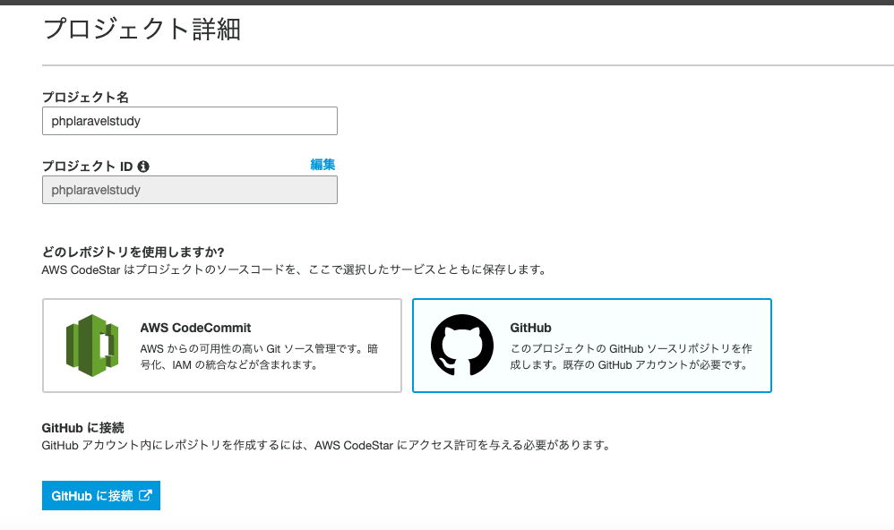

プロジェクトを作成するを選択。

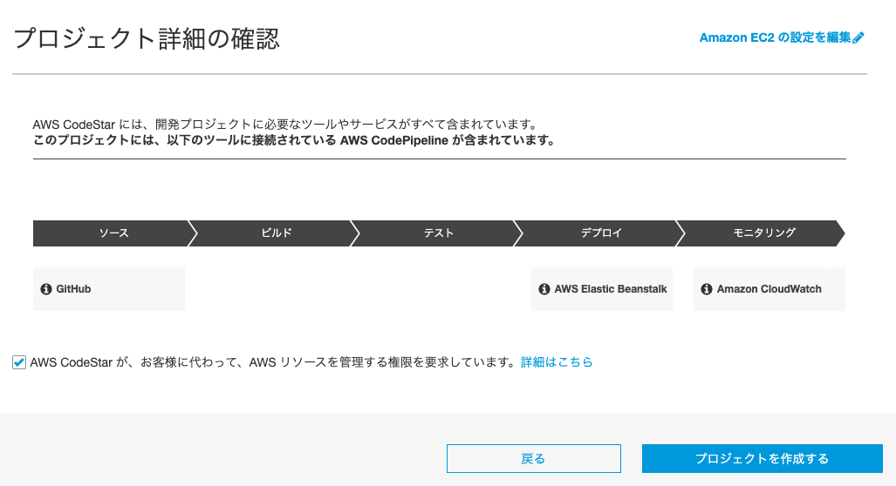

キーペアを作成して、プロジェクトを作成するを選択

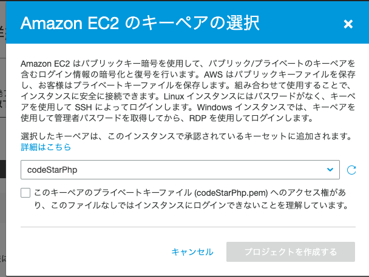

次を選択

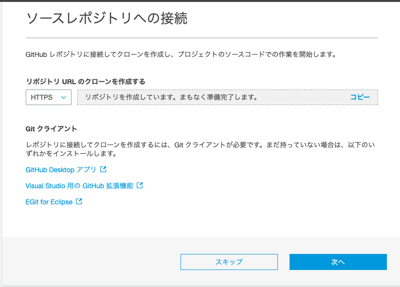

しばらくすると環境が作成されることを確認

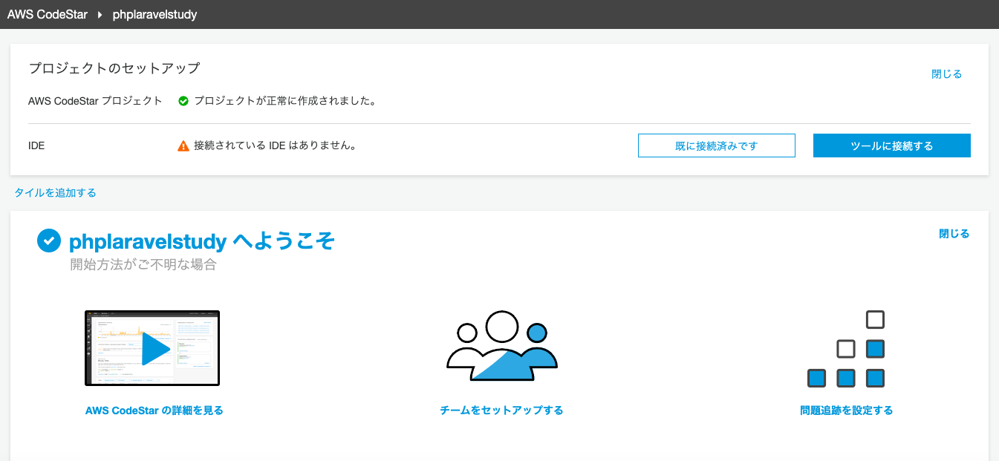

EC2から対象のインスタンスを確認。パブリックのIPアドレスをコピーする

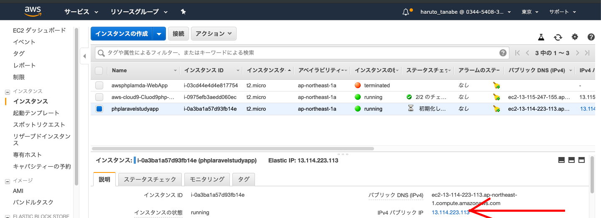

ブラウザでコピーしたURLにアクセスするとlaravelの画面が表示される

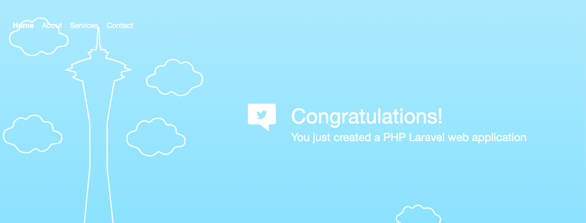

GitHubのソースコードを編集してプッシュする。

その後AWS CodeBuildが立ち上がっていることを確認

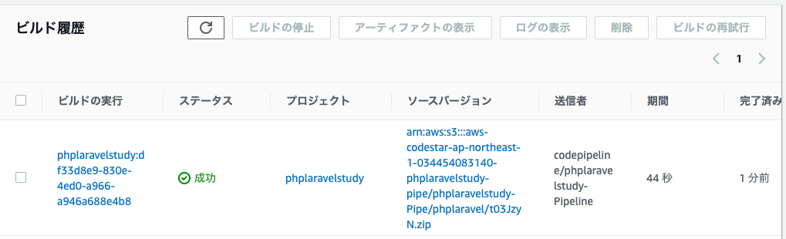

再度画面を確認すると自動的に変更されてことを確認

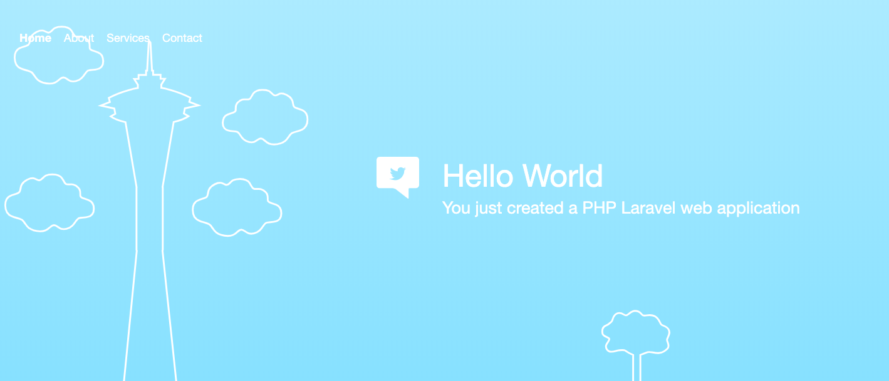

Cloud9を立ち上げ、画面下のターミナルよりGitをクローンする
再度コードを編集してみると問題なく動いていることを確認

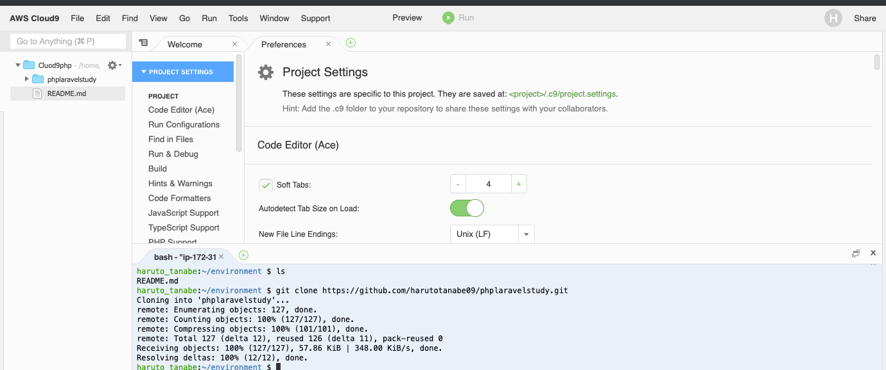

