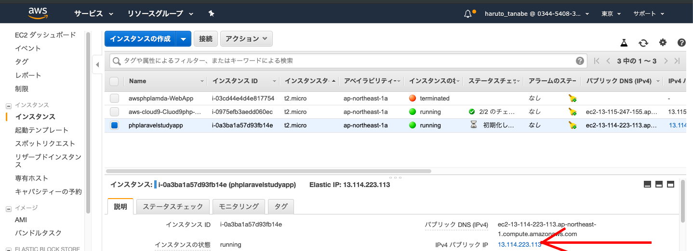
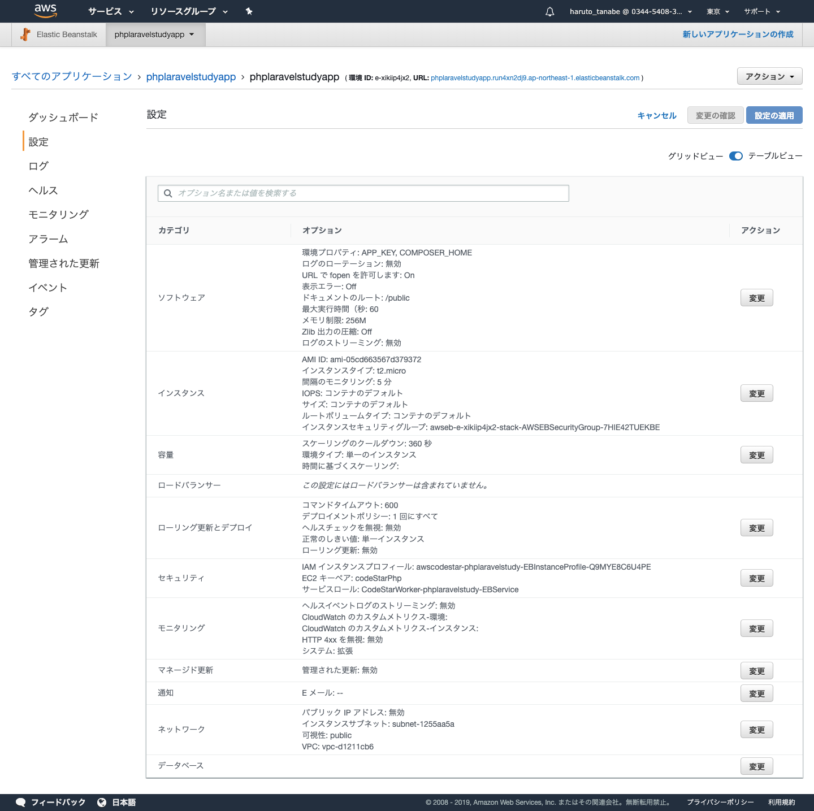
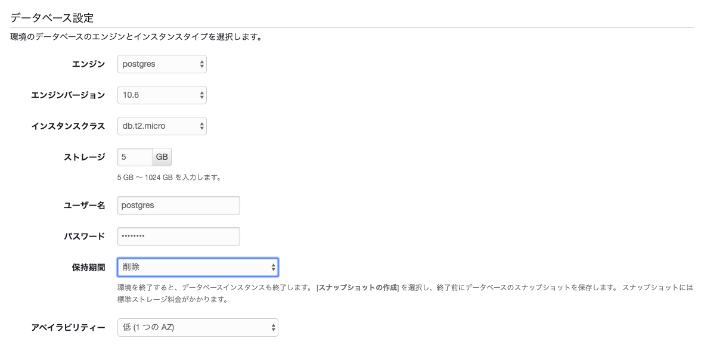
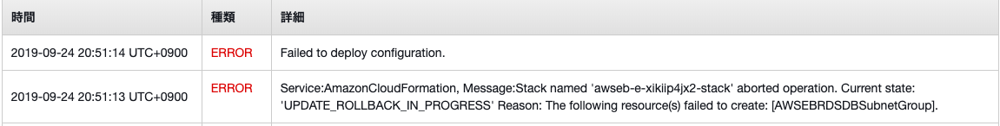

### CodeStarを使う 〜laravel〜

CodeStarを選択して新規プロジェクトの作成選択


プロジェクトのテンプレートでPHP(Laravel)を選択
※　ElasticBeanstalkを選択。理由：デプロイした状態まで保存可能。


プロジェクト名を入力。Githubに接続で、自身のGithubアカウントにログイン。

プロジェクトを作成するを選択。


キーペアを作成して、プロジェクトを作成するを選択
 ダウンロードしたキーファイルは保存しておくこと


次を選択


しばらくすると環境が作成されることを確認


EC2から対象のインスタンスを確認。パブリックのIPアドレスをコピーする



ブラウザでコピーしたURLにアクセスするとlaravelの画面が表示される


GitHubのソースコードを編集してプッシュする。

その後AWS CodeBuildが立ち上がっていることを確認


再度画面を確認すると自動的に変更されてことを確認


Cloud9を立ち上げ、画面下のターミナルよりGitをクローンする
再度コードを編集してみると問題なく動いていることを確認


ダウンロードしたキーファイルをもとにEC2にログインする

以下、Macの場合。

```shell

ssh ec2-user@ec2-XX-XXX-XXX-XXX.ap-northeast-1.compute.amazonaws.com -i ＜キーファイル＞.pem

```


ElasticBeanstalkを選択して、

設定ー＞データベースの変更ボタンを選択


データベースの設定より以下を設定するし、変更の適用を選択する



 セキュリティのエラーのため失敗する

