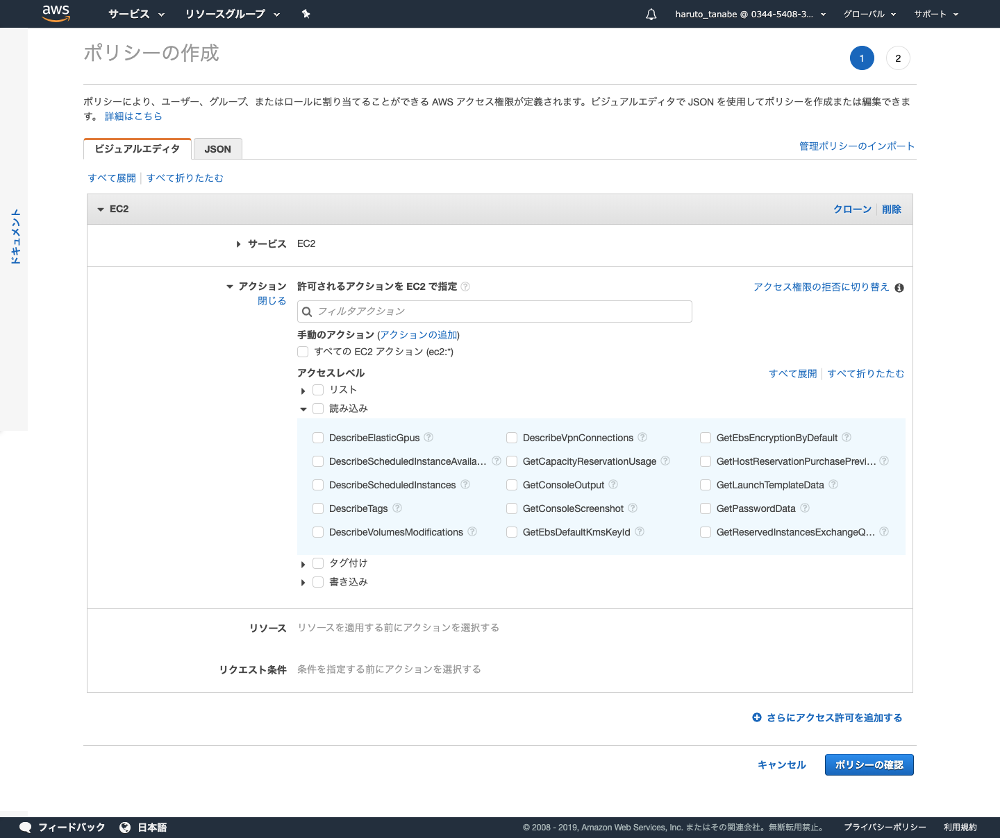
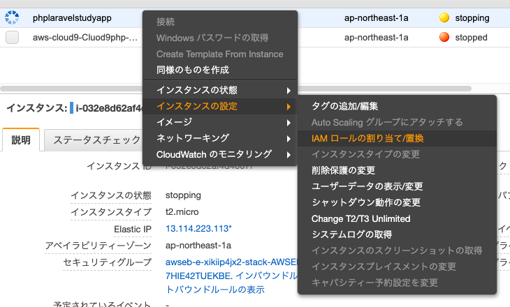

### IAMの設定

IAMは、アクセス権限の許可の仕組み

・ルートユーザ

　→　アカウント管理時に作成されるユーザー。通常は使用しない。神様権限。

　→　使う場合は、MFA認証にする

　→　ルートユーザ特別権限ある　例）CloudFrontキーベア作成、AWSアカウント停止、課金情報のアクセス

・ IAMユーザー

　→　１アカウントで１００グループで作成

　→　アクセスキー

・IAMポリシー

　→　AWS管理ポリシー

　→　カスタム管理ポリシー　組織単位で設定

　→　インラインポリシー　機能単位に設定

　→　JSON形式で表記する

　→　ポリシーは、ユーザとリソースに対して設定できる

・一時的なポリシー付与

　→　トークンを与えて一時的にアクセスできる

・IAM設計のベストプラクティス

　→　ルートユーザは利用しない

　→　ルートユーザーはMFA認証にする

　→　利用ごとにIAMユーザを作成する

　→　ユーザのパスワードポリシーを強度にする

　→　ユーザが2,3人の場合でもグループで作成するのが望ましい

・IAMの実際の設定手順

ポリシーの作成画面

サービスごと（EC2)、アクション毎、リソース毎（送信元のIP制限）を設定可能。

クローンすることも可能

以下の様にEC2インスタンス毎にIAMロールの割当をすることが可能

AWS Organization

IAMアクセスを組織単位で楽に管理するためのマネージメントサービス

### 小問題

パワーユーザー

